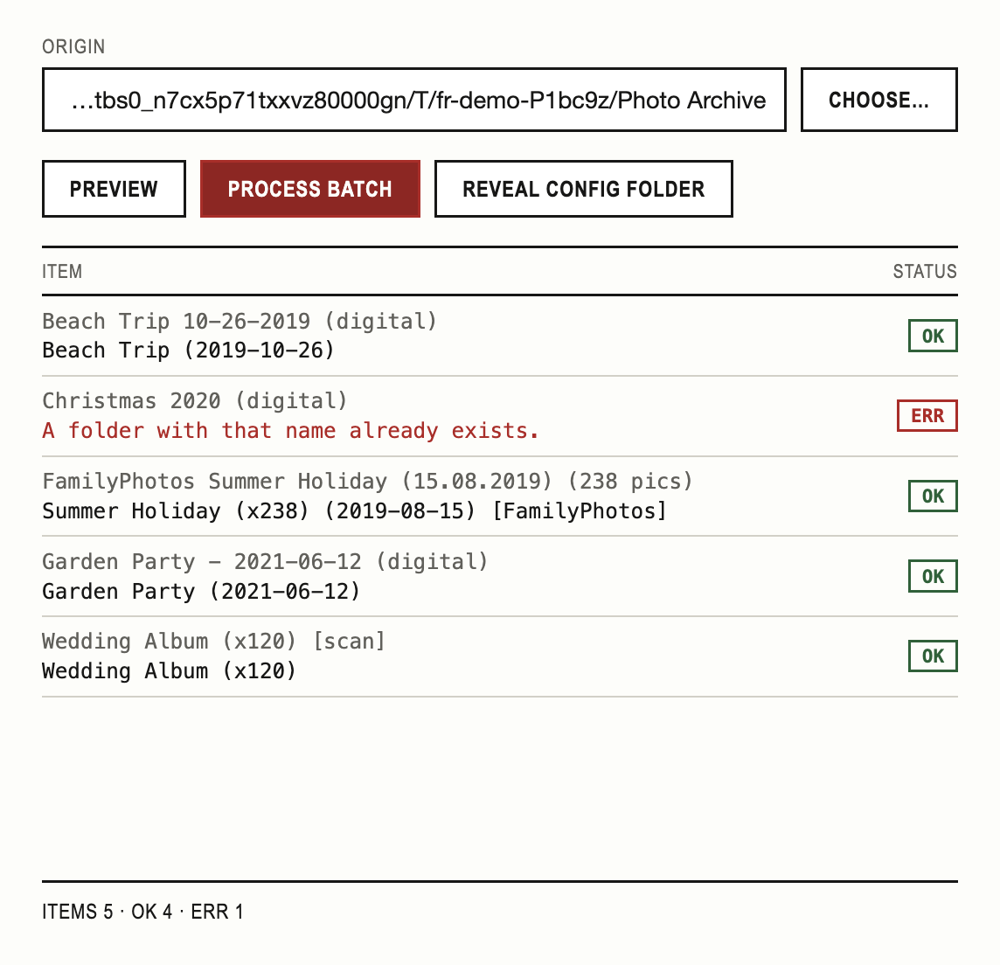

# Folder Renamer

A Node.js CLI that batch-renames folders — cleaning up dates, image counts, and known prefixes so messy photo and scan archives end up consistently named.

## Screenshots and demo



## Tech stack

- Node.js (ES modules)
- [Electron](https://www.electronjs.org/) for the desktop app
- [electron-store](https://www.npmjs.com/package/electron-store) for persisted app settings
- [dotenv](https://www.npmjs.com/package/dotenv) for the CLI's environment configuration
- [Vitest](https://vitest.dev/) for testing

## Notable decisions

- **In-place renaming** — folders are renamed directly, with no undo. Back up before running.
- **Remove vs. replace patterns are separate files** — `removePatterns.json` strips text entirely (the replacement is always empty), `replacePatterns.json` substitutes text with something else. Splitting them avoids repeating `"replacement": ""` across dozens of entries.
- **Pattern data isn't committed to git** — `src/data/*.json` holds hand-curated, personal scrubbing rules (scene-release tags, download-site cruft) that don't belong in a public repo. It's gitignored, so each clone builds its own list.
- **The desktop app copies its config out of the app bundle on first run** — once packaged, `src/data/` is read-only, so the Electron app copies it into its own userData folder the first time it starts, and reads/writes there from then on. That way, app updates never overwrite your real, evolving pattern list. If `src/data/` doesn't have a file to copy — for example running the app straight from a fresh clone, before creating your own — it starts that file as an empty list instead of failing to launch.
- **Preview/dry-run doesn't predict rename failures** — it shows what each folder would be renamed to, but not whether that rename would collide with something and fail. Accurately predicting that without attempting it is unreliable; a wrong prediction would be worse than none. Real failures still surface clearly when you actually run it.

## Local development

```bash
git clone https://github.com/Karl-Horning/folder-renamer.git
cd folder-renamer
npm install
npm start
```

Add `--dry-run` to preview what would be renamed without touching anything: `npm start -- --dry-run`.

## Configuration

Create a `.env` file in the project root:

```env
DIRECTORY_PATH=/absolute/path/to/folder
```

Three files in `src/data/` drive the transform. None of them ship with defaults, so all three need creating:

- **`prefixes.json`** — array of prefix strings to move to the end of a folder name, wrapped in `[]`.

  ```json
  ["MyPhotos", "FamilyPhotos"]
  ```

- **`removePatterns.json`** — strings or regex patterns to strip entirely. Use `isRegex: true` for regex, `caseInsensitive: true` to match regardless of case.

  ```json
  [
    { "text": "(digital)", "caseInsensitive": true },
    { "text": "\\b\\d{2,5}px\\b", "isRegex": true }
  ]
  ```

- **`replacePatterns.json`** — text substitutions, where the match is replaced with something else rather than removed. Supports the same `isRegex` and `caseInsensitive` options.

  ```json
  [
    { "text": " - ", "replacement": ", " },
    { "text": ".nl", "replacement": "NL", "caseInsensitive": true }
  ]
  ```

## Desktop app

The Electron app runs the same rename logic as the CLI, with a window to trigger it and a Preferences window to change the target folder — no `.env` file needed. Its settings and pattern config live in `~/Library/Application Support/Folder Renamer/`, seeded from `src/data/` the first time it runs. **Preview** shows what would be renamed without touching anything, the same as the CLI's `--dry-run`.

```bash
npm run electron   # run in development
npm run dist       # build a distributable .app
```

**First run:**

1. Open **Preferences** (`Cmd+,`) and choose the folder you want to clean up.
2. The app starts with no rename rules — **Preview** and **Process Batch** won't find anything to do until you add some. Open **Reveal Config Folder** (`Cmd+Shift+R`) from the menu and edit `prefixes.json`, `removePatterns.json`, and `replacePatterns.json` there; see [Configuration](#configuration) above for the format each one expects.
3. Click **Preview** to check what would change, then **Process Batch** to actually rename.

Keyboard shortcuts (also in the menu bar):

| Shortcut | Action |
| --- | --- |
| `Cmd+,` | Open Preferences |
| `Cmd+Shift+P` | Preview |
| `Cmd+Return` | Process Batch |
| `Cmd+Shift+R` | Reveal Config Folder |

## Scripts

| Script | Description |
| --- | --- |
| `npm start` | Run the folder-renaming CLI |
| `npm run electron` | Run the desktop app |
| `npm run dist` | Build a distributable `.app` |
| `npm test` | Run the unit test suite once |
| `npm run test:watch` | Re-run unit tests on file changes |
| `npm run test:e2e` | Launch the real desktop app and drive it end-to-end |

## Feedback and issues

Found a bug or have a suggestion? [Open an issue](https://github.com/Karl-Horning/folder-renamer/issues).

## License

Released under the [MIT License](./LICENSE) by [Karl Horning](https://github.com/Karl-Horning).
